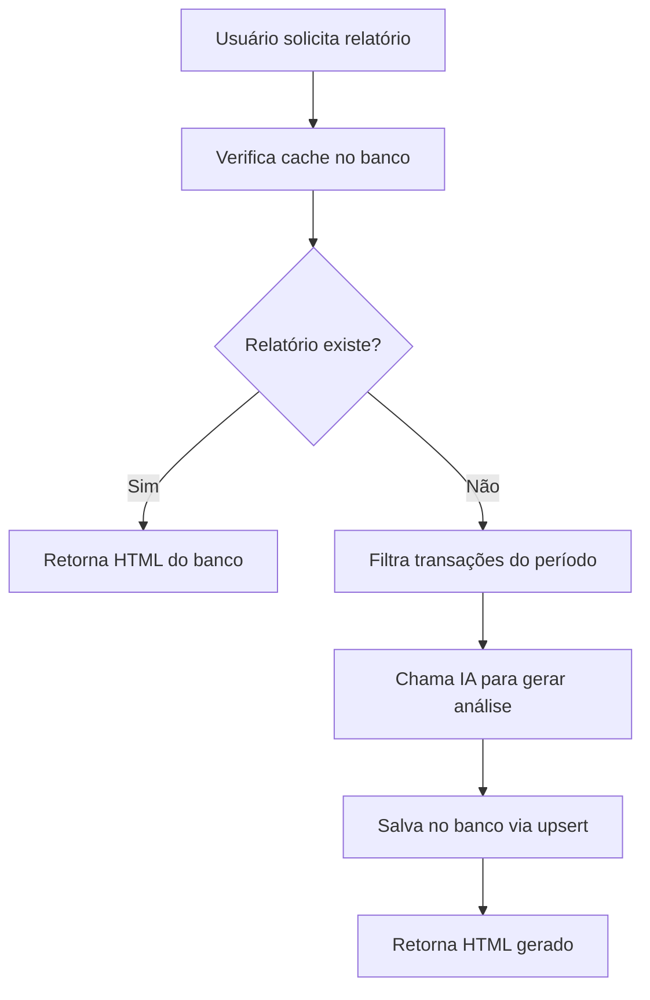

# Implementação de Persistência para Relatórios Financeiros

## 📋 Resumo das Mudanças

Foi implementada a persistência de relatórios financeiros no banco de dados PostgreSQL, substituindo o armazenamento temporário em memória.

## 🗃️ Estrutura no Banco de Dados

### Tabela: `saved_reports`

```sql
CREATE TABLE saved_reports (
    id VARCHAR PRIMARY KEY DEFAULT cuid(),
    owner_id VARCHAR NOT NULL,
    month_year VARCHAR NOT NULL,
    analysis_html TEXT NOT NULL,
    created_at TIMESTAMP NOT NULL DEFAULT NOW(),
    
    UNIQUE(owner_id, month_year)
);
```

## 🔧 Arquivos Criados/Modificados

### 1. **ReportService.ts** (Novo)
- **Localização**: `src/services/ReportService.ts`
- **Funcionalidades**:
  - `getReport()` - Busca relatório existente
  - `saveReport()` - Salva/atualiza relatório (upsert)
  - `deleteReport()` - Remove relatório específico
  - `getUserReports()` - Lista todos os relatórios de um usuário
  - `cleanOldReports()` - Remove relatórios antigos (90+ dias)

### 2. **actions.ts** (Modificado)
- **Localização**: `src/app/reports/actions.ts`
- **Mudanças**:
  - Substituição de `savedReports` array por `ReportService`
  - Cache agora consulta o banco de dados
  - Persistência automática após geração pela IA
  - Invalidação via exclusão no banco

### 3. **definitions.ts** (Atualizado)
- **Localização**: `src/lib/definitions.ts`
- **Mudanças**:
  - Adicionado `createdAt: Date` ao tipo `SavedReport`

### 4. **data.ts** (Atualizado)
- **Localização**: `src/lib/data.ts`
- **Mudanças**:
  - Removido array `savedReports` (marcado como deprecated)

### 5. **report-utils.ts** (Novo)
- **Localização**: `src/lib/report-utils.ts`
- **Funcionalidades**:
  - `cleanupOldReports()` - Limpeza automática
  - `listUserReports()` - Debug/admin de relatórios

## 🚀 Benefícios da Implementação

### ✅ **Persistência Real**
- Relatórios mantidos mesmo após reinicialização do servidor
- Dados seguros contra falhas de sistema

### ✅ **Performance Otimizada**
- Cache inteligente via banco de dados
- Evita regeneração desnecessária pela IA
- Consultas rápidas com índices únicos

### ✅ **Escalabilidade**
- Suporte a múltiplas instâncias do servidor
- Cache compartilhado entre instâncias
- Limpeza automática de dados antigos

### ✅ **Confiabilidade**
- Transações ACID do PostgreSQL
- Constraint de unicidade evita duplicações
- Logs detalhados para debug

## 🔄 Fluxo de Funcionamento



## 🛠️ Comandos de Manutenção

### Limpeza Manual de Relatórios Antigos
```typescript
import { cleanupOldReports } from '@/lib/report-utils';

// Remove relatórios com mais de 90 dias
const result = await cleanupOldReports();
console.log(`${result.deletedCount} relatórios removidos`);
```

### Listar Relatórios de um Usuário
```typescript
import { listUserReports } from '@/lib/report-utils';

const reports = await listUserReports('user_id');
console.log(reports);
```

## 📊 Monitoramento

### Logs de Sistema
- ✅ Sucesso ao salvar: *"Relatório salvo com sucesso"*
- ⚠️ Cache miss: *"Gerando novo relatório"*
- 🧹 Limpeza: *"X relatórios removidos"*
- ❌ Erro de persistência: *"Falha ao salvar relatório"*

## 🔮 Próximos Passos

1. **Cron Job**: Implementar limpeza automática diária
2. **Métricas**: Dashboard de uso de relatórios
3. **Export**: Funcionalidade de download em PDF
4. **Templates**: Múltiplos estilos de relatório
5. **Compartilhamento**: URLs públicas para relatórios

---

**Status**: ✅ **Implementado e Funcionando**  
**Versão**: 1.0  
**Data**: 14 de novembro de 2025