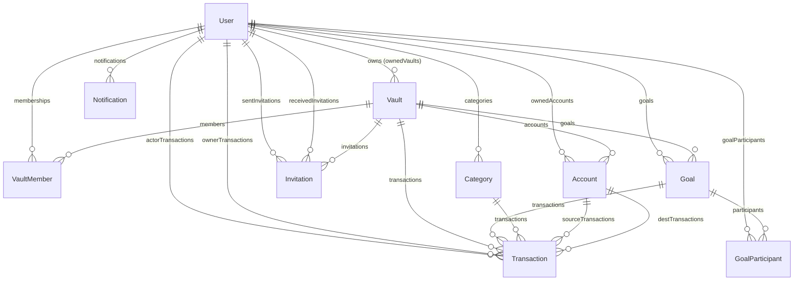

# 📦 Caixinhas — Documentação Técnica Interna para Integração Telegram Bot

> **Objetivo:** Fornecer o contexto completo do sistema Caixinhas para que um assistente de IA (Gemini) possa, via n8n, receber mensagens do Telegram e executar operações financeiras através de Tools (chamadas HTTP ao backend).

---

## Sumário

1. [Visão Geral da Arquitetura](#1-visão-geral-da-arquitetura)
2. [Estrutura de Banco de Dados (Prisma Schema)](#2-estrutura-de-banco-de-dados-prisma-schema)
3. [Identificação de Usuários e Campo `telegram_chat_id`](#3-identificação-de-usuários-e-campo-telegram_chat_id)
4. [Autenticação e Segurança](#4-autenticação-e-segurança)
5. [Camada de Serviços (Service Layer)](#5-camada-de-serviços-service-layer)
6. [Server Actions Existentes](#6-server-actions-existentes)
7. [Rotas de API (Route Handlers)](#7-rotas-de-api-route-handlers)
8. [Operações Principais para o Bot](#8-operações-principais-para-o-bot)
9. [Recomendações para a API do Bot](#9-recomendações-para-a-api-do-bot)

---

## 1. Visão Geral da Arquitetura

```
┌──────────────────────────────────────────────────────────────┐
│                         CAIXINHAS                            │
│                                                              │
│  Framework: Next.js (App Router)                             │
│  ORM: Prisma                                                 │
│  Banco: PostgreSQL (Supabase)                                │
│  Auth: NextAuth.js v4 (Credentials Provider + JWT)           │
│  Deploy: Vercel / Firebase App Hosting                       │
│  Pagamento: Kiwify (webhook)                                 │
│  Email: Resend                                               │
│  Storage: AWS S3                                             │
│                                                              │
│  Padrão de Dados:                                            │
│  - Server Actions ('use server') para mutations da UI        │
│  - Route Handlers (API Routes) para webhooks/auth/support    │
│  - Service Layer centralizado em src/services/               │
└──────────────────────────────────────────────────────────────┘
```

### Stack Tecnológica
| Componente | Tecnologia |
|---|---|
| Frontend/Backend | Next.js 14+ (App Router) |
| Banco de Dados | PostgreSQL via Supabase |
| ORM | Prisma Client |
| Autenticação | NextAuth.js v4 (JWT strategy) |
| Validação | Zod |
| UI | React + TailwindCSS + shadcn/ui |
| Email | Resend |
| Pagamentos | Kiwify (webhooks) |

### Estrutura de Diretórios Relevante

```
src/
├── app/
│   ├── (private)/              # Rotas protegidas (autenticadas)
│   │   ├── accounts/actions.ts
│   │   ├── dashboard/actions.ts
│   │   ├── goals/actions.ts
│   │   ├── transactions/actions.ts
│   │   ├── notifications/actions.ts
│   │   ├── patrimonio/actions.ts
│   │   ├── profile/actions.ts
│   │   ├── recurring/actions.ts
│   │   ├── reports/actions.ts
│   │   └── ...
│   ├── api/
│   │   ├── auth/[...nextauth]/  # NextAuth handler
│   │   ├── auth/register/       # POST /api/auth/register
│   │   ├── webhooks/kiwify/     # POST /api/webhooks/kiwify
│   │   └── support/             # POST /api/support
│   └── vaults/actions.ts
├── services/                    # ⭐ Camada de serviço (lógica de negócio)
│   ├── auth.service.ts
│   ├── account.service.ts
│   ├── transaction.service.ts
│   ├── transaction.query.service.ts
│   ├── transaction.analysis.service.ts
│   ├── goal.service.ts
│   ├── vault.service.ts
│   ├── notification.service.ts
│   ├── category.service.ts
│   ├── ReportService.ts
│   └── prisma.ts
├── lib/
│   ├── auth.ts                  # NextAuth configuration
│   ├── access-control.ts        # Controle de acesso por subscription
│   ├── action-helpers.ts        # Helpers para server actions
│   └── definitions.ts           # Tipos TypeScript
└── middleware.ts                # Middleware de autenticação
```

---

## 2. Estrutura de Banco de Dados (Prisma Schema)

**Arquivo fonte:** `prisma/schema.prisma`
**Banco:** PostgreSQL | **Relation Mode:** Prisma

### 2.1. Modelo `User` (tabela `users`)

```prisma
model User {
  id                 String    @id @default(cuid())   // ⭐ CHAVE PRIMÁRIA — CUID alfanumérico
  email              String    @unique
  name               String
  password           String                           // bcrypt hash (12 rounds)
  avatarUrl          String?
  workspaceImageUrl  String?
  subscriptionStatus String    @default("trial")      // 'trial' | 'active' | 'inactive'
  trialExpiresAt     DateTime?
  resetToken         String?
  resetTokenExpiry   DateTime?
  magicLinkToken     String?   @unique
  magicLinkExpires   DateTime?
  createdAt          DateTime  @default(now())
  updatedAt          DateTime  @updatedAt

  // Relações
  ownedVaults         Vault[]           @relation("Owner")
  memberships         VaultMember[]
  ownedAccounts       Account[]
  sentInvitations     Invitation[]      @relation("Sender")
  receivedInvitations Invitation[]      @relation("Receiver")
  notifications       Notification[]
  transactionsAsActor Transaction[]     @relation("ActorTransactions")
  transactionsAsOwner Transaction[]     @relation("OwnerTransactions")
  goals               Goal[]
  goalParticipants    GoalParticipant[]
  categories          Category[]
}
```

> ⚠️ **CAMPO `telegram_chat_id`:** **NÃO EXISTE ATUALMENTE.** Precisa ser adicionado. Recomendação: adicionar `telegramChatId String? @unique` ao modelo `User`. Ver [seção 3](#3-identificação-de-usuários-e-campo-telegram_chat_id).

### 2.2. Modelo `Vault` (tabela `vaults`) — Cofre Compartilhado

```prisma
model Vault {
  id        String   @id @default(cuid())
  name      String
  imageUrl  String?
  ownerId   String
  isPrivate Boolean  @default(false)    // Cofres privados NÃO podem receber convites
  createdAt DateTime @default(now())
  updatedAt DateTime @updatedAt

  owner        User          @relation("Owner", fields: [ownerId], references: [id])
  members      VaultMember[]
  accounts     Account[]
  transactions Transaction[]
  invitations  Invitation[]
  goals        Goal[]
}
```

**Conceito de Cofre/Vault:**
- Cada usuário ao se registrar recebe automaticamente **1 cofre compartilhado padrão** (`Cofre de {nome}`)
- O cofre é o **workspace compartilhado** — permitindo que casais/famílias/grupos gerenciem finanças juntas
- Transações ficam vinculadas ao cofre (`vaultId`) ou ao workspace pessoal (`userId`)
- O conceito de "workspace pessoal" é quando `workspaceId === userId` (não é um vault, é o espaço individual)

### 2.3. Modelo `VaultMember` (tabela `vault_members`) — Membros do Cofre

```prisma
model VaultMember {
  id      String @id @default(cuid())
  vaultId String
  userId  String
  role    String @default("member")    // 'owner' | 'admin' | 'member'
  
  @@unique([vaultId, userId])
}
```

### 2.4. Modelo `Account` (tabela `accounts`) — Contas Bancárias

```prisma
model Account {
  id          String   @id @default(cuid())
  name        String                           // Ex: "Nubank", "Conta Bradesco"
  bank        String                           // Nome do banco
  type        String                           // 'checking' | 'savings' | 'investment' | 'credit_card' | 'other'
  balance     Float
  creditLimit Float?
  logoUrl     String?
  scope       String                           // 'personal' ou um vaultId
  visibleIn   String[] @default([])            // Array de vaultIds onde é visível

  ownerId String
  vaultId String?
}
```

**Regras de visibilidade de contas:**
- `scope = 'personal'`: conta pertence ao workspace pessoal do usuário
- `scope = {vaultId}`: conta pertence diretamente a um cofre
- `visibleIn`: array de vault IDs onde uma conta pessoal também aparece (sem transferir ownership)

### 2.5. Modelo `Transaction` (tabela `transactions`) — Transações/Lançamentos

```prisma
model Transaction {
  id              String   @id @default(cuid())
  date            DateTime
  description     String
  amount          Float
  type            String                       // 'income' | 'expense' | 'transfer'
  paymentMethod   String?                      // 'pix' | 'credit_card' | 'debit_card' | 'transfer' | 'boleto' | 'cash'
  isRecurring     Boolean  @default(false)
  isInstallment   Boolean  @default(false)
  installmentNumber Int?
  totalInstallments Int?
  paidInstallments  Int[]  @default([])
  recurringId     String?                      // UUID para agrupar recorrentes

  actorId              String                  // Quem executou a ação (SEMPRE preenchido)
  userId               String?                 // Workspace pessoal (preenchido OU vaultId)
  vaultId              String?                 // Cofre (preenchido OU userId)
  categoryId           String?
  sourceAccountId      String?                 // Conta de origem (expense/transfer)
  destinationAccountId String?                 // Conta de destino (income/transfer)
  goalId               String?                 // Meta/Caixinha vinculada
}
```

**Regras de ownership de transação:**
- **SEMPRE** deve ter `actorId` (quem fez)
- **EXATAMENTE UM** de `userId` ou `vaultId` (onde pertence)
- `type = 'expense'` → obrigatório `sourceAccountId`
- `type = 'income'` → obrigatório `destinationAccountId`
- `type = 'transfer'` → obrigatório origem E destino (pode ser conta→conta, conta→goal, ou goal→conta)

### 2.6. Modelo `Goal` (tabela `goals`) — Caixinhas/Metas

```prisma
model Goal {
  id            String  @id @default(cuid())
  name          String
  description   String?
  targetAmount  Float
  currentAmount Float   @default(0)            // Saldo atual da caixinha
  emoji         String
  visibility    String  @default("shared")     // 'private' | 'shared'
  isFeatured    Boolean @default(false)        // Aparece no dashboard

  userId  String?                               // Meta pessoal
  vaultId String?                               // Meta de cofre
  
  participants GoalParticipant[]
  transactions Transaction[]
}
```

### 2.7. Modelo `GoalParticipant` (tabela `goal_participants`)

```prisma
model GoalParticipant {
  id     String @id @default(cuid())
  goalId String
  userId String
  role   String @default("member")             // 'owner' | 'member'
  
  @@unique([goalId, userId])
}
```

### 2.8. Modelo `Invitation` (tabela `invitations`) — Convites

```prisma
model Invitation {
  id            String   @id @default(cuid())
  type          String                          // 'vault' | 'goal'
  targetId      String                          // ID do vault ou goal
  targetName    String
  senderId      String
  receiverId    String?                         // Null se convidado por email (ainda não tem conta)
  receiverEmail String?                         // Email do convidado (null se já tem conta)
  status        String   @default("pending")    // 'pending' | 'accepted' | 'declined'
  createdAt     DateTime @default(now())
  updatedAt     DateTime @updatedAt
}
```

### 2.9. Modelo `Notification` (tabela `notifications`)

```prisma
model Notification {
  id        String   @id @default(cuid())
  userId    String
  type      String                              // 'vault_invite' | 'transaction_added' | 'goal_progress' | 'vault_member_added' | 'system'
  message   String
  isRead    Boolean  @default(false)
  link      String?
  relatedId String?                             // ID de recurso relacionado (ex: invitationId)
  createdAt DateTime @default(now())
}
```

### 2.10. Modelo `SavedReport` (tabela `saved_reports`)

```prisma
model SavedReport {
  id                String   @id @default(cuid())
  ownerId           String                      // userId ou vaultId
  monthYear         String                      // Ex: "Março de 2025"
  analysisHtml      String                      // HTML do relatório gerado pela IA
  transactionCount  Int      @default(0)
  createdAt         DateTime @default(now())
  updatedAt         DateTime @updatedAt
  
  @@unique([ownerId, monthYear])
}
```

### 2.11. Modelo `Category` (tabela `categories`)

```prisma
model Category {
  id      String @id @default(cuid())
  name    String
  ownerId String
  
  @@unique([name, ownerId])
}
```

**Categorias padrão criadas no registro:**
`Alimentação`, `Moradia`, `Transporte`, `Lazer`, `Saúde`, `Educação`, `Vestuário`, `Contas e Utilidades`, `Salário`, `Freelance`, `Investimentos`, `Presente`, `Transferência`, `Caixinha`, `Outros`

### 2.12. Diagrama de Relacionamentos (ER Simplificado)



---

## 3. Identificação de Usuários e Campo `telegram_chat_id`

### 3.1. Chave Primária Atual

| Campo | Tipo | Descrição |
|---|---|---|
| `id` | `String` (CUID) | Chave primária, gerada automaticamente. Ex: `cm2abc123def456` |
| `email` | `String` (UNIQUE) | Identificador secundário único |

O **CUID** é um ID alfanumérico com prefixo (`cm...`), não é UUID nem auto-incremento.

### 3.2. Campo `telegramChatId` — PRECISA SER CRIADO

**Não existe** atualmente nenhum campo para vincular o chat_id do Telegram ao usuário.

**Recomendação de migração Prisma:**

```prisma
model User {
  // ... campos existentes ...
  telegramChatId   String?   @unique   // Chat ID do Telegram para integração do bot
}
```

**Migração SQL:**
```sql
ALTER TABLE "users" ADD COLUMN "telegramChatId" TEXT UNIQUE;
```

**Fluxo de vinculação sugerido:**
1. Usuário envia `/start` no bot do Telegram
2. Bot recebe o `chat_id` do Telegram
3. Bot pede ao usuário para informar o email cadastrado no Caixinhas
4. n8n faz uma requisição à API do Caixinhas para vincular `telegramChatId` ao `User` pelo email
5. Opcionalmente, enviar um código de verificação por email para confirmar

### 3.3. Busca de Usuário pelo `telegramChatId`

Após a implementação, a busca ficaria:
```typescript
const user = await prisma.user.findUnique({
  where: { telegramChatId: chatId.toString() }
});
```

---

## 4. Autenticação e Segurança

### 4.1. Sistema Atual de Autenticação

| Aspecto | Implementação |
|---|---|
| **Biblioteca** | NextAuth.js v4 |
| **Strategy** | JWT (NÃO database sessions) |
| **Providers** | `CredentialsProvider` (email + senha) |
| **Token Lifetime** | 30 dias |
| **Password Hash** | bcrypt (12 rounds) |
| **Google OAuth** | Desabilitado (pendente aprovação) |
| **Magic Link** | Implementado (token de uso único, 24h de validade) |

### 4.2. Fluxo de Autenticação Web

```
1. POST /api/auth/callback/credentials
   Body: { email, password }
   ↓
2. CredentialsProvider.authorize()
   → AuthService.login() → bcrypt.compare()
   ↓
3. JWT Callback: token.id = user.id
   ↓
4. Session Callback: busca user no banco, retorna dados atualizados
   ↓
5. Cookie: next-auth.session-token (JWT assinado com NEXTAUTH_SECRET)
```

### 4.3. Middleware de Proteção de Rotas

**Arquivo:** `src/middleware.ts`

```typescript
// Rotas públicas (sem token):
// /login, /register, /terms, /privacy, /forgot-password, /reset-password, 
// /invitation/*, /landing/*, /api/auth/*

// Todas as outras rotas exigem token JWT válido
```

### 4.4. Sistema de Controle de Acesso por Assinatura

**Arquivo:** `src/lib/access-control.ts`

| Status | Nível de Acesso |
|---|---|
| `trial` (válido) | **Full** — Acesso total ao sistema |
| `active` | **Full** — Assinante pagante |
| `inactive` / `trial` (expirado) | **Restricted** — Apenas aceitar convites e colaborar em cofres de outros |

### 4.5. 🔒 Autenticação Server-to-Server (Para o Bot)

> **NÃO EXISTE ATUALMENTE** um padrão de API Key ou Bearer Token estático para comunicação server-to-server.

O único padrão existente de "autenticação externa" é o **webhook da Kiwify**, que usa:
- Header `x-kiwify-signature` (HMAC-SHA1 com secret)
- Variável de ambiente: `KIWIFY_WEBHOOK_SECRET`

**Para o bot do n8n, é necessário criar uma solução dedicada.** Recomendação na [seção 9](#9-recomendações-para-a-api-do-bot).

### 4.6. Verificação de Sessão em Server Actions

Todas as server actions usam um padrão consistente:

```typescript
// Padrão 1: Verificação simples
const session = await getServerSession(authOptions);
if (!session?.user?.id) return { success: false, message: 'Não autenticado' };

// Padrão 2: Verificação com controle de acesso (subscription check)
const { requireFullAccess } = await import('@/lib/action-helpers');
const accessCheck = await requireFullAccess();
if (!accessCheck.success || !accessCheck.data) {
  return { success: false, message: accessCheck.error };
}
const userId = accessCheck.data.id;
```

---

## 5. Camada de Serviços (Service Layer)

A lógica de negócio está centralizada em `src/services/`. Estes serviços são **stateless** e usam **métodos estáticos**. São a camada ideal para o bot chamar.

### 5.1. `AuthService` (`auth.service.ts`)

| Método | Assinatura | Descrição |
|---|---|---|
| `login` | `(data: { email, password }) → UserWithoutPassword \| null` | Autentica com bcrypt |
| `register` | `(data: { name, email, password }) → UserWithoutPassword` | Cria user + categorias + cofre padrão |
| `getUserById` | `(id: string) → UserWithoutPassword \| null` | Busca user por ID |
| `getUserByEmail` | `(email: string) → UserWithoutPassword \| null` | Busca user por email |
| `updateProfile` | `(userId, { name?, avatarUrl?, workspaceImageUrl? }) → UserWithoutPassword` | Atualiza perfil |
| `updateSubscriptionStatus` | `(userId, status) → void` | Atualiza assinatura |
| `generateMagicLinkToken` | `(email) → string \| null` | Gera token de login sem senha |
| `validateMagicLinkToken` | `(token) → UserWithoutPassword \| null` | Valida e consome token |

**Tipo `UserWithoutPassword`:**
```typescript
{
  id: string;
  email: string;
  name: string;
  avatarUrl: string | null;
  workspaceImageUrl: string | null;
  subscriptionStatus: string;    // 'trial' | 'active' | 'inactive'
  trialExpiresAt: Date | null;
  createdAt: Date;
  updatedAt: Date;
}
```

### 5.2. `TransactionService` (`transaction.service.ts`)

| Método | Assinatura | Descrição |
|---|---|---|
| `createTransaction` | `(data: CreateTransactionInput) → Transaction` | Cria transação atomicamente (+ atualiza saldos) |
| `updateTransaction` | `(id, data) → Transaction` | Atualiza com compensação de saldos |
| `deleteTransaction` | `(id) → void` | Deleta com reversão de saldos |
| `getTransactions` | `(ownerId, ownerType, options?) → { transactions, total }` | Lista paginada com filtros |
| `getRecentTransactions` | `(ownerId, ownerType, limit) → Transaction[]` | Últimas N transações |
| `getTransactionById` | `(id) → Transaction \| null` | Busca por ID |
| `getCurrentMonthTransactions` | `(ownerId, ownerType) → Transaction[]` | Transações do mês atual |
| `processRecurringTransactions` | `(userId) → void` | Gera transações recorrentes pendentes |

**Tipo `CreateTransactionInput`:**
```typescript
{
  userId?: string;              // Preencher se workspace pessoal
  vaultId?: string;             // Preencher se cofre
  date: Date;
  description: string;
  amount: number;               // Valor positivo (SEMPRE)
  type: 'income' | 'expense' | 'transfer';
  category: string;             // Nome da categoria (connectOrCreate automático)
  actorId: string;              // User ID de quem executou
  paymentMethod?: string | null;
  sourceAccountId?: string | null;
  destinationAccountId?: string | null;
  goalId?: string | null;
  isRecurring?: boolean;
  isInstallment?: boolean;
  installmentNumber?: number;
  totalInstallments?: number;
  paidInstallments?: number[];
  projectRecurring?: boolean;
  recurringId?: string;
}
```

**⚡ Side Effects automáticos do `createTransaction`:**
- `expense` + `sourceAccountId` → **debita** saldo da conta
- `income` + `destinationAccountId` → **credita** saldo da conta
- `transfer` + `goalId` + `sourceAccountId` → **Depósito na caixinha** (debita conta, credita goal)
- `transfer` + `goalId` + `destinationAccountId` → **Retirada da caixinha** (debita goal, credita conta)
- `transfer` + `sourceAccountId` + `destinationAccountId` → **Transferência entre contas**

### 5.3. `AccountService` (`account.service.ts`)

| Método | Assinatura | Descrição |
|---|---|---|
| `createAccount` | `(data) → Account` | Cria conta bancária |
| `getUserAccounts` | `(userId) → Account[]` | Lista contas pessoais |
| `getVisibleAccounts` | `(userId, scope) → Account[]` | Contas visíveis num contexto |
| `getAccountById` | `(id) → Account \| null` | Busca por ID |
| `updateAccount` | `(id, data) → Account` | Atualiza conta |
| `deleteAccount` | `(id) → void` | Exclui conta |
| `updateBalance` | `(id, amount, type, tx?) → void` | Atualiza saldo (increment/decrement) |
| `getAccountBalances` | `(userId, scope) → { liquid, invested, creditCardDebt }` | Saldos agregados por tipo |
| `calculateLiquidAssets` | `(userId, scope) → number` | Total ativos líquidos |
| `calculateInvestedAssets` | `(userId, scope) → number` | Total investido |

### 5.4. `GoalService` (`goal.service.ts`)

| Método | Assinatura | Descrição |
|---|---|---|
| `createGoal` | `(data) → Goal` | Cria caixinha/meta |
| `updateGoal` | `(id, data) → Goal` | Atualiza caixinha |
| `deleteGoal` | `(id) → void` | Exclui caixinha |
| `getGoalById` | `(id) → Goal \| null` | Busca por ID |
| `getGoals` | `(ownerId, ownerType) → Goal[]` | Lista metas de contexto |
| `getUserGoals` | `(userId) → Goal[]` | Metas pessoais |
| `getVaultGoals` | `(vaultId) → Goal[]` | Metas de um cofre |
| `getFeaturedGoals` | `(ownerId, ownerType) → Goal[]` | Metas em destaque |
| `addToGoal` | `(goalId, amount, tx?) → Goal` | Adiciona valor a meta |
| `removeFromGoal` | `(goalId, amount, tx?) → Goal` | Remove valor de meta |
| `calculateTotalSaved` | `(ownerId, ownerType) → number` | Total guardado em metas |
| `toggleFeatured` | `(goalId) → Goal` | Alterna destaque |

### 5.5. `VaultService` (`vault.service.ts`)

| Método | Assinatura | Descrição |
|---|---|---|
| `getUserVaults` | `(userId) → VaultWithMembers[]` | Cofres do usuário |
| `getVaultById` | `(id) → VaultWithMembers \| null` | Busca por ID |
| `createVault` | `(data) → VaultWithMembers` | Cria cofre |
| `updateVault` | `(id, data) → VaultWithMembers` | Atualiza cofre |
| `deleteVault` | `(id) → void` | Exclui cofre |
| `addMember` | `(vaultId, userId, role?) → void` | Adiciona membro |
| `removeMember` | `(vaultId, userId) → void` | Remove membro |
| `isMember` | `(vaultId, userId) → boolean` | Verifica membership |
| `createInvitation` | `(vaultId, senderId, email, ctx?) → void` | Cria convite |
| `acceptInvitation` | `(invitationId, userId) → void` | Aceita convite |
| `declineInvitation` | `(invitationId, userId) → void` | Recusa convite |

### 5.6. `NotificationService` (`notification.service.ts`)

| Método | Assinatura | Descrição |
|---|---|---|
| `createNotification` | `(data) → NotificationData` | Cria notificação |
| `getUserNotifications` | `(userId) → NotificationData[]` | Lista todas |
| `getUnreadNotifications` | `(userId) → NotificationData[]` | Apenas não lidas |
| `getUnreadCount` | `(userId) → number` | Contagem não lidas |
| `markAsRead` | `(id) → void` | Marca como lida |
| `markAllAsRead` | `(userId) → void` | Marca todas como lidas |

### 5.7. `CategoryService` (`category.service.ts`)

| Método | Assinatura | Descrição |
|---|---|---|
| `getUserCategories` | `(userId) → Category[]` | Lista categorias |
| `createCategory` | `(name, ownerId) → Category` | Cria categoria |
| `updateCategory` | `(id, name, ownerId) → Category` | Atualiza |
| `deleteCategory` | `(id, ownerId) → void` | Exclui |

### 5.8. `ReportService` (`ReportService.ts`)

| Método | Assinatura | Descrição |
|---|---|---|
| `getReport` | `(ownerId, monthYear) → SavedReport \| null` | Busca relatório |
| `saveReport` | `(data) → SavedReport \| null` | Salva relatório |
| `getUserReports` | `(ownerId) → SavedReport[]` | Lista relatórios |
| `getTransactionsForPeriod` | `(ownerId, month, year) → Transaction[]` | Transações do período |

### 5.9. `TransactionAnalysisService`

| Método | Assinatura | Descrição |
|---|---|---|
| `calculateTotalIncome` | `(ownerId, ownerType) → number` | Total de receitas |
| `calculateTotalExpenses` | `(ownerId, ownerType) → number` | Total de despesas |

---

## 6. Server Actions Existentes

As server actions operam via `FormData` e são **específicas da UI do Next.js** (não são REST APIs). Elas chamam a Service Layer internamente.

### 6.1. Transactions (`src/app/(private)/transactions/actions.ts`)

| Action | Descrição | Auth |
|---|---|---|
| `addTransaction(prevState, formData)` | Cria transação | `requireFullAccess()` |
| `updateTransaction(prevState, formData)` | Atualiza transação | `getServerSession()` |
| `deleteTransaction(prevState, formData)` | Exclui transação | Validação mínima |

### 6.2. Goals (`src/app/(private)/goals/actions.ts`)

| Action | Descrição | Auth |
|---|---|---|
| `createGoalAction(prevState, formData)` | Cria caixinha | `requireFullAccess()` |
| `updateGoalAction(prevState, formData)` | Atualiza caixinha | `requireFullAccess()` |
| `depositToGoalAction(prevState, formData)` | Deposita na caixinha | `getServerSession()` |
| `withdrawFromGoalAction(prevState, formData)` | Retira da caixinha | `getServerSession()` |
| `deleteGoalAction(goalId)` | Exclui caixinha | `getServerSession()` |
| `toggleFeaturedGoalAction(goalId)` | Alterna destaque | — |

### 6.3. Accounts (`src/app/(private)/accounts/actions.ts`)

| Action | Descrição | Auth |
|---|---|---|
| `createAccount(formData)` | Cria conta | `requireFullAccess()` |
| `updateAccount(accountId, formData)` | Atualiza conta | `requireFullAccess()` |
| `deleteAccount(accountId)` | Exclui conta | `getServerSession()` |
| `createCategory(prevState, formData)` | Cria categoria | `getServerSession()` |

---

## 7. Rotas de API (Route Handlers)

### 7.1. Autenticação NextAuth

| Rota | Método | Descrição |
|---|---|---|
| `/api/auth/[...nextauth]` | `GET/POST` | Handler automático do NextAuth (login, callback, session, etc.) |

### 7.2. Registro de Usuário

| Rota | Método | Descrição |
|---|---|---|
| `POST /api/auth/register` | `POST` | Registra novo usuário |

**Payload:**
```json
{
  "name": "string (min 2 chars)",
  "email": "string (valid email)",
  "password": "string (min 6 chars)"
}
```

**Resposta (201):**
```json
{
  "message": "Usuário criado com sucesso",
  "user": {
    "id": "cm2xxx...",
    "name": "...",
    "email": "...",
    "avatarUrl": "...",
    "subscriptionStatus": "trial",
    "trialExpiresAt": "2025-01-01T...",
    "createdAt": "..."
  }
}
```

### 7.3. Webhook Kiwify (Pagamentos)

| Rota | Método | Descrição |
|---|---|---|
| `POST /api/webhooks/kiwify` | `POST` | Recebe eventos de compra/cancelamento |

**Autenticação:** Header `x-kiwify-signature` (HMAC-SHA1)

**Eventos tratados:**
- `order_approved` / `subscription_renewed` → Ativa assinatura
- `order_refunded` / `chargeback` → Revoga acesso
- `subscription_canceled` → Revoga acesso
- `subscription_late` / `payment_failed` → Notifica por email

### 7.4. Suporte

| Rota | Método | Descrição |
|---|---|---|
| `POST /api/support` | `POST` | Envia mensagem de suporte por email |

**Payload (JSON):**
```json
{
  "fromEmail": "string",
  "fromName": "string",
  "subject": "string",
  "message": "string"
}
```

---

## 8. Operações Principais para o Bot

Estas são as operações que o Gemini deve expor como **Tools** para o bot do Telegram:

### 8.1. 💰 Criar Transação (Despesa/Receita)

**Service:** `TransactionService.createTransaction()`

**Payload mínimo para despesa:**
```json
{
  "userId": "cm2xxx...",
  "date": "2025-04-05T12:00:00.000Z",
  "description": "Almoço no restaurante",
  "amount": 45.90,
  "type": "expense",
  "category": "Alimentação",
  "actorId": "cm2xxx...",
  "paymentMethod": "pix",
  "sourceAccountId": "clxxx..."
}
```

**Payload mínimo para receita:**
```json
{
  "userId": "cm2xxx...",
  "date": "2025-04-05T12:00:00.000Z",
  "description": "Salário mensal",
  "amount": 5000.00,
  "type": "income",
  "category": "Salário",
  "actorId": "cm2xxx...",
  "destinationAccountId": "clxxx..."
}
```

**Retorno:** Objeto `Transaction` completo.

### 8.2. 📊 Consultar Saldo Atual

**Services:**
- `AccountService.getAccountBalances(userId, scope)` → Retorna `{ liquid, invested, creditCardDebt }`
- `AccountService.getUserAccounts(userId)` → Lista todas as contas com saldos
- `GoalService.calculateTotalSaved(userId, 'user')` → Total em caixinhas

**Exemplo de retorno de `getAccountBalances`:**
```json
{
  "liquid": 15430.50,
  "invested": 8200.00,
  "creditCardDebt": -1250.00
}
```

**Patrimônio total = liquid + invested + creditCardDebt + totalSaved**

### 8.3. 🎯 Depositar/Retirar de Caixinha

**Para Depositar:** `TransactionService.createTransaction()` com:
```json
{
  "userId": "cm2xxx...",
  "date": "2025-04-05T12:00:00.000Z",
  "description": "Depósito na Caixinha",
  "amount": 200.00,
  "type": "transfer",
  "category": "Depósito na Caixinha",
  "actorId": "cm2xxx...",
  "sourceAccountId": "clxxx...",
  "goalId": "clyyy..."
}
```

**Para Retirar:** `TransactionService.createTransaction()` com:
```json
{
  "userId": "cm2xxx...",
  "date": "2025-04-05T12:00:00.000Z",
  "description": "Retirada da Caixinha",
  "amount": 100.00,
  "type": "transfer",
  "category": "Retirada da Caixinha",
  "actorId": "cm2xxx...",
  "destinationAccountId": "clxxx...",
  "goalId": "clyyy..."
}
```

> O `TransactionService` já lida com atualizar o `currentAmount` da Goal e o `balance` da Account atomicamente.

### 8.4. 📋 Listar Transações Recentes

**Service:** `TransactionService.getRecentTransactions(userId, 'user', 10)`

### 8.5. 📋 Listar Caixinhas com Progresso

**Service:** `GoalService.getUserGoals(userId)`

### 8.6. 📋 Listar Contas Bancárias

**Service:** `AccountService.getUserAccounts(userId)`

---

## 9. Recomendações para a API do Bot

### 9.1. Autenticação Server-to-Server

Como o sistema não possui autenticação S2S, **recomenda-se criar uma rota API dedicada** para o bot:

```
src/app/api/bot/
├── route.ts              # Middleware de auth com API Key
├── transactions/route.ts # CRUD de transações
├── balance/route.ts      # Consultas de saldo
├── goals/route.ts        # Operações com caixinhas
└── user/route.ts         # Busca de usuário por telegramChatId
```

**Padrão de autenticação sugerido:**

```typescript
// src/app/api/bot/middleware.ts
export function validateBotRequest(request: Request): boolean {
  const apiKey = request.headers.get('X-Bot-API-Key');
  return apiKey === process.env.BOT_API_KEY;
}
```

**Variáveis de ambiente necessárias:**
```env
BOT_API_KEY=uma-chave-secreta-de-pelo-menos-32-chars
```

### 9.2. Exemplo de Rota para o Bot

```typescript
// src/app/api/bot/transactions/route.ts
import { NextRequest, NextResponse } from 'next/server';
import { TransactionService } from '@/services/transaction.service';
import { prisma } from '@/services/prisma';

export async function POST(request: NextRequest) {
  // 1. Validar API Key
  const apiKey = request.headers.get('X-Bot-API-Key');
  if (apiKey !== process.env.BOT_API_KEY) {
    return NextResponse.json({ error: 'Unauthorized' }, { status: 401 });
  }

  // 2. Identificar usuário pelo telegramChatId
  const body = await request.json();
  const user = await prisma.user.findUnique({
    where: { telegramChatId: body.telegramChatId }
  });
  
  if (!user) {
    return NextResponse.json({ error: 'Usuário não vinculado' }, { status: 404 });
  }

  // 3. Executar operação
  const transaction = await TransactionService.createTransaction({
    ...body.transaction,
    actorId: user.id,
    userId: user.id,
  });

  return NextResponse.json({ success: true, transaction });
}
```

### 9.3. Endpoints Sugeridos para o n8n

| Endpoint | Método | Descrição | Headers |
|---|---|---|---|
| `POST /api/bot/user/lookup` | POST | Busca user por `telegramChatId` | `X-Bot-API-Key` |
| `POST /api/bot/user/link` | POST | Vincula `telegramChatId` ao user | `X-Bot-API-Key` |
| `POST /api/bot/transactions` | POST | Cria transação | `X-Bot-API-Key` |
| `GET /api/bot/balance?chatId=xxx` | GET | Consulta saldo | `X-Bot-API-Key` |
| `GET /api/bot/goals?chatId=xxx` | GET | Lista caixinhas | `X-Bot-API-Key` |
| `POST /api/bot/goals/deposit` | POST | Deposita na caixinha | `X-Bot-API-Key` |
| `GET /api/bot/accounts?chatId=xxx` | GET | Lista contas | `X-Bot-API-Key` |
| `GET /api/bot/transactions/recent?chatId=xxx` | GET | Últimas transações | `X-Bot-API-Key` |
| `GET /api/bot/categories?chatId=xxx` | GET | Lista categorias | `X-Bot-API-Key` |

### 9.4. Fluxo Completo n8n → Gemini → Caixinhas

```
┌─────────┐     ┌──────┐     ┌────────┐     ┌───────────┐
│ Telegram │────→│ n8n  │────→│ Gemini │────→│ Caixinhas │
│  (user)  │     │      │     │  API   │     │  Bot API  │
└─────────┘     └──────┘     └────────┘     └───────────┘
     ↑                                            │
     └────────────────────────────────────────────┘
                   (resposta ao user)

1. User envia: "gastei 50 reais no uber"
2. n8n recebe mensagem do Telegram
3. n8n envia para Gemini com prompt + tools disponíveis
4. Gemini identifica: type=expense, amount=50, category=Transporte, description=Uber
5. Gemini chama tool: POST /api/bot/transactions
6. Caixinhas cria transação e atualiza saldo
7. n8n retorna confirmação ao Telegram: "✅ Despesa registrada: R$ 50,00 - Uber (Transporte)"
```

### 9.5. Bypass do Middleware

As rotas `/api/*` já estão excluídas do middleware de autenticação NextAuth (ver matcher em `middleware.ts`):

```typescript
matcher: [
  '/((?!api|_next/static|_next/image|...).*)' // <-- /api já está excluída
]
```

Portanto, `/api/bot/*` não será interceptada pelo NextAuth. A autenticação será exclusivamente via `X-Bot-API-Key`.

---

## Variáveis de Ambiente Relevantes

| Variável | Descrição |
|---|---|
| `DATABASE_URL` | Connection string PostgreSQL (pooled) |
| `DIRECT_URL` | Connection string PostgreSQL (direta, para migrations) |
| `NEXTAUTH_SECRET` | Secret para assinar JWTs |
| `NEXTAUTH_URL` | URL base da aplicação (ex: `https://caixinhas.app`) |
| `KIWIFY_WEBHOOK_SECRET` | Secret para validar webhooks Kiwify |
| `BOT_API_KEY` | ⚠️ **A CRIAR** — Chave para autenticar o bot |

---

> **Documento gerado em:** 05/04/2026
> **Fonte:** Análise direta do código-fonte do repositório `caixinhas-finance-app`
